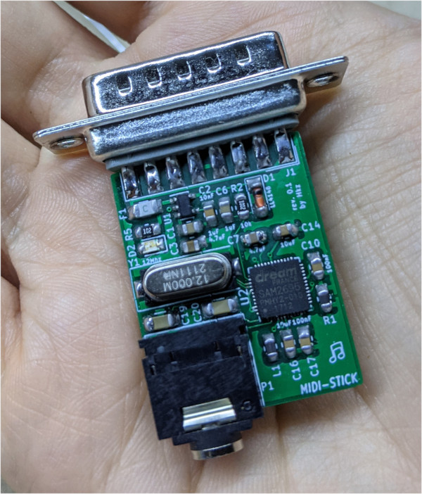

# MIDI Stick

## Introduction

The MIDI-Stick is a small General MIDI Synth based on the SAM2695 chip that you can plug directly in the joystick port of your sound card.

It produces a line-out signal that you can feed to the line-in of your sound card or use with an external amplifier or headphones!

### Disclaimer

I take NO responsibility for what happens if you decide to build and use this card. Your computer might crash, catch fire or be destroyed in other nasty ways.
You're encourauged to take what you deem fit from this, and use it in your projects!

## Bill of Materials

| Component         | Qty | Type / Value        | Mouser code           |
| ----------------- | --- | ------------------- | --------------------- |
| C1,C6             | 2   | 1uF / 0805          | [710-885012207022](https://www.mouser.it/ProductDetail/710-885012207022) |
| C2                | 1   | 10nF / 0805         | [710-885382207006](https://www.mouser.it/ProductDetail/710-885382207006) |
| C3,C7             | 2   | 4.7uF / 0805        | [187-CL21A475KPFNNNG](https://www.mouser.it/ProductDetail/187-CL21A475KPFNNNG) |
| C4,C5             | 2   | 22pF / 0805         | [710-885012007053](https://www.mouser.it/ProductDetail/710-885012007053) |
| C8,C9,C10,C15,C17 | 5   | 100nF / 0805        | [710-885012207072](https://www.mouser.it/ProductDetail/710-885012207072) |
| C14,C16,C18       | 3   | 10uF / 0805         | [187-CL21A106KPFNNNG](https://www.mouser.it/ProductDetail/187-CL21A106KPFNNNG) |
| C19,C20           | 2   | 100uF / 1206        | [81-GRM31CR61A107ME5L](https://www.mouser.it/ProductDetail/81-GRM31CR61A107ME5L) |
| D1                | 1   | LL4148              | [512-LL4148](https://www.mouser.it/ProductDetail/512-LL4148) |
| D2                | 1   | LED / 0805          | [710-150080RS75000](https://www.mouser.it/ProductDetail/710-150080RS75000) |
| L1                | 1 (or 2)  | Inductor 742792093  | [710-742792093](https://www.mouser.it/ProductDetail/710-742792093) |
| R1                | 1 (or 0)  | 0 ohm or same as L1 | [71-CRCW08050000Z0EAC](https://www.mouser.it/ProductDetail/71-CRCW08050000Z0EAC) |
| R2                | 1   | 10k / 0805          | [71-CRCW080510K0FKEAC](https://www.mouser.it/ProductDetail/71-CRCW080510K0FKEAC) |
| R3,R4             | 2   | 47k / 0805          | [652-CR0805FX-4702ELF](https://www.mouser.it/ProductDetail/652-CR0805FX-4702ELF) |
| R5                | 1   | 1k / 0805           | [71-CRCW08051K00JNEAC](https://www.mouser.it/ProductDetail/71-CRCW08051K00JNEAC) |
| F1                | 1   | SMD Fuse            | [652-SF-1206HI050M-2](https://www.mouser.it/ProductDetail/652-SF-1206HI050M-2) |
| J1                | 1   | DB15 Male           | [806-K22X-A15SN](https://www.mouser.it/ProductDetail/806-K22X-A15SN) |
| P1                | 1   | Stereo audio jack   | [806-STX-3100-3CB](https://www.mouser.it/ProductDetail/806-STX-3100-3CB) |
| Y1                | 1   | 12Mhz / HC49        | [449-LFXTAL035293REEL](https://www.mouser.it/ProductDetail/449-LFXTAL035293REEL) |
| U1                | 1   | LP2085-3.3          | [926-LP2985IM5X33NOPB](https://www.mouser.it/ProductDetail/926-LP2985IM5X33NOPB) |
| U2                | 1   | SAM2695             | |

## Credits

Thanks to [Sergey Kiselev](https://github.com/skiselev) for his symbol/footprint library!

